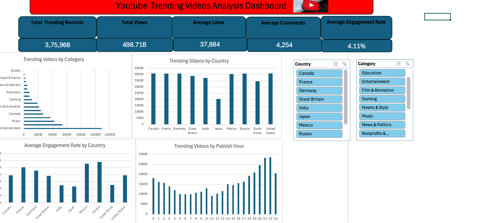

# YouTube Trending Videos Analysis Dashboard

## Project Overview
This Excel project analyzes YouTube trending video performance across countries, categories, engagement metrics, and publishing times. The dashboard provides an interactive view of the data to identify key trends and patterns.

## Key KPIs
•⁠  ⁠Total Trending Records: 375,968
•⁠  ⁠Total Views: 498.71B
•⁠  ⁠Average Likes: 37,884
•⁠  ⁠Average Comments: 4,254
•⁠  ⁠Average Engagement Rate: 4.11%

## Dashboard Analysis
The dashboard includes:
•⁠  ⁠Trending Videos by Category
•⁠  ⁠Trending Videos by Country
•⁠  ⁠Average Engagement Rate by Country
•⁠  ⁠Trending Videos by Publish Hour
•⁠  ⁠Country and Category filters for interactive analysis

## Tools Used
•⁠  ⁠Microsoft Excel
•⁠  ⁠Pivot Tables
•⁠  ⁠Pivot Charts
•⁠  ⁠Slicers
•⁠  ⁠Data Analysis
•⁠  ⁠Dashboard Visualization

## Dashboard Preview

## Project Goal
The objective of this project is to demonstrate practical Excel data-analysis skills, KPI creation, visualization, dashboard development, and the ability to transform a large dataset into meaningful business insights.

## Note
The complete Excel workbook is not uploaded because of its large file size. The dashboard preview demonstrates the final analysis and visualization.
